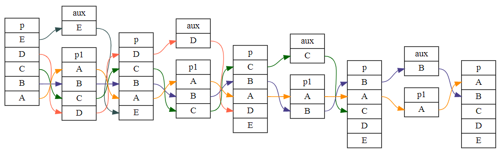
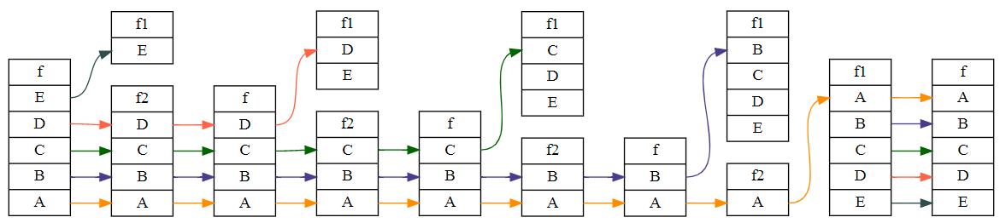

# Introdução

Esta lista de exercícios foi proposta pelo Prof. Dr. Igor Machado Coelho, como atividade continuada do tópico Estruturas Lineares na disciplina de Estrutura de Dados e Algoritmos, do Programa de Pós-graduação em Ciência da Computação (PGC) da Universidade Federal Fluminense (UFF), Campus Niterói.

O autor é servidor público no Instituto Federal de Rondônia (IFRO) - _Campus_ Vilhena e atua como docente nas disciplinas da área de Engenharia Elétrica, também é aluno, em nível de doutorado, do PGC-UFF e participa do Projeto de Cooperação entre Instituições para Qualificação de Profissionais de Nível Superior (PCI), firmado entre o IFRO e a UFF.

Esta lista de exercícios serviu de oportunidade para que o autor tivesse uma introdução à orientação à objetos e estrutura de projeto utilizando boas práticas de programação. Foi um desafio sair do pensamento de programação estruturada, com o código em apenas um arquivo e passar a separar as funções em arquivos e subpastas. Tanto os arquivos de cabeçalho (.hpp) quanto as implementações (.cpp) foram separados na subpasta "include". 

Todos os arquivos de cabeçalho começam com diretivas ``#ifndef`` e ``#define`` que evitam referência cíclica, e finalizam com a diretiva ``#include``, que referencia o arquivo de implementação. A exemplo do arquivo _dequeEncadeado.hpp_, abaixo:

```cpp
#ifndef _DEQUE_ENCADEADO_HPP_
#define _DEQUE_ENCADEADO_HPP_

// [...]

#include "dequeEncadeado.cpp"
#endif
```

Seguindo as diretrizes da lista de exercícios, este documento foca mais na lógica do que em programação. É uma discussão da proposta do algoritmo, dos aprendizados do percurso e uma análise da complexidade assintótica dos métodos implementados. Porém, todas as implementações foram testadas e aprovados pelo autor, com código disponibilizado no GitHub [__https://github.com/ecostadelle/lista_pilhas_filas__].

A seguir, cada capítulo deste documento apresenta a resposta de um exercício.

# Exercício 1

## a) Implementação de um Double Ended Queue (DEQUE) encadeado

A fim de responder essa questão implementei tanto o deque [__sequencial__](https://github.com/ecostadelle/lista_pilhas_filas/blob/main/include/dequeSequencial.hpp) (as ligações para os arquivos no repositório aparecem em negrito) quanto o [__encadeado__](https://github.com/ecostadelle/lista_pilhas_filas/blob/main/include/dequeEncadeado.hpp). Porém, me limitei a comentar apenas no deque [__encadeado__](https://github.com/ecostadelle/lista_pilhas_filas/blob/main/include/dequeEncadeado.hpp) porque foi o que trouxe maior aprendizado. Antes de implementá-lo, a alocação dinâmica era bem nebulosa para mim. Preferi utilizar o tipo genérico, de modo que a implementação pudesse ser reaproveitada em exercícios posteriores, a exemplo das alternativas dessa questão e do Exercício 7, que foi em ordem cronológica o 2º exercício a ser implementado.

Preferi, também, destinar apenas uma pasta para os arquivos Os arquivos de cabeçalho e foram A escolha pelo tipo genérico, associado à estrutura de diretórios

No arquivo de [__cabeçalho__](https://github.com/ecostadelle/lista_pilhas_filas/blob/main/include/dequeEncadeado.hpp), foram definidas as estruturas necessárias para implementar o Deque Encadeado. A primeira classe (``NoDeque``) foi o nó, que armazena um dado do tipo genérico e dois ponteiros que apontam para os nós anterior (``*noAnterior``) e posterior (``*noSeguinte``). 

```cpp
template<typename TipoGenerico>
class NoDeque 
{
public:
    TipoGenerico dado;
    NoDeque<TipoGenerico> *noSeguinte; 
    NoDeque<TipoGenerico> *noAnterior;
};                 
```

O tipo genérico do dado armazenado precisa ser definido na declaração da variável e é atribuída à classe em tempo de compilação. Inclusive tive muitos problemas quando escolhi esse método, porque eu estava compilando os objetos separados e vinculando-os posteriormente. 

Na segunda classe (``Deque``), foram declarados em modo privado os ponteiros que apontam apenas para dois nós, o inicial e o final. As interfaces padrão foram declaradas em modo público, de maneira que permitiam o acesso externo a classe.

``` cpp
template <typename TipoGenerico>
class Deque 
{
private:
    NoDeque<TipoGenerico> *inicio;
    NoDeque<TipoGenerico> *fim;
    int numeroElementos;

public:
    Deque();
    ~Deque();
    void insereInicio(TipoGenerico v);
    void insereFim(TipoGenerico v);
    int tamanho();
    TipoGenerico buscaInicio();
    TipoGenerico buscaFim();
    TipoGenerico removeInicio();
    TipoGenerico removeFim();
};
```

Os métodos tiveram seu próprio arquivo de [__implementação (dequeEncadeado.cpp)__](https://github.com/ecostadelle/lista_pilhas_filas/blob/main/include/dequeEncadeado.cpp). Além dos métodos solicitados através do ``concept``, foram implementados um construtor ``Deque()``, que inicia as variáveis em tempo constante $O(1)$, e um destrutor ``~Deque()``, que ao se invocado, percorre todos os elementos do deque, liberando a memória e evita o "vazamento de memória". A complexidade do método destrutor é linearmente depende do tamanho armazenado em ``numeroElementos`` ($n$), ou seja, $O(n)$ 

```cpp
#include "dequeEncadeado.hpp"

template <typename TipoGenerico>
Deque<TipoGenerico>::Deque()
{
    this->numeroElementos = 0;
    this->inicio = nullptr;
    this->fim = nullptr;
}

template <typename TipoGenerico>
Deque<TipoGenerico>::~Deque()
{
    while (this->numeroElementos > 0)
        removeInicio();
} 
```

No método ``insereInicio()`` um nó é criado e alocado dinamicamente na memória, um ponteiro (``*no``) armazena o endereço e um dado é inserido. Caso o deque esteja vazio, os endereços de início e fim serão os mesmo do nó recém criado. Caso contrário, o campo ``noSeguinte`` do nó recém criado recebe o endereço daquele que era o início, e o campo ``noAnterior``, daquele que era o inicio, recebe o endereço do novo nó e o número de elementos no deque é incrementado. Este método opera em tempo constante, ou seja, $O(1)$.

```cpp
template <typename TipoGenerico>
void Deque<TipoGenerico>::insereInicio(TipoGenerico v)
{
    NoDeque<TipoGenerico> *no =
        new NoDeque
        {.dado = v,
         .noSeguinte = nullptr,
         .noAnterior = nullptr};
    if (numeroElementos == 0)
    {
        inicio = fim = no;
    }
    else 
    {
        no->noSeguinte = inicio;
        inicio->noAnterior = no;
        inicio = no;
    }
    numeroElementos++;
}
```

No método ``insereFim()`` ocorre um procedimento semelhante ao descrito anteriormente, porém na outra ponta. E opera, também, em tempo constante, ou seja, $O(1)$.

```cpp
template <typename TipoGenerico>
void Deque<TipoGenerico>::insereFim(TipoGenerico v)
{
    NoDeque<TipoGenerico> *no =
        new NoDeque<TipoGenerico> 
        {.dado = v,
         .noSeguinte = nullptr,
         .noAnterior = nullptr};
    if (numeroElementos == 0)
    {
        inicio = fim = no;
    }
    else
    {
        no->noAnterior = fim;
        fim->noSeguinte = no;
        fim = no;
    }
    numeroElementos++;
}
```

Já os métodos ``tamanho()``, ``buscaInicio()`` e ``buscaFim()`` apenas retornam variáveis que estão privadas, é um modo seguro de se criar uma interface. Operam em tempo constante ($O(1)$).

```cpp
template <typename TipoGenerico>
int Deque<TipoGenerico>::tamanho()
{
    return this->numeroElementos;
}

template <typename TipoGenerico>
TipoGenerico Deque<TipoGenerico>::buscaInicio()
{
    return inicio->dado;
}

template <typename TipoGenerico>
TipoGenerico Deque<TipoGenerico>::buscaFim()
{ 
    return fim->dado;
}
```

Os métodos ``removeInicio()`` e ``removeFim()`` operam em tempo constante ($O(1)$) e quando um deles é invocado, ele armazena o endereço do nó que será removido, coleta o dado armazenado, remove o nó, decrementa o número de elementos, define a nova ponta da fila (seja no início, seja no fim) e retorna o valor lido.

```cpp
template <typename TipoGenerico>
TipoGenerico Deque<TipoGenerico>::removeInicio()
{
    NoDeque<TipoGenerico> *p = inicio;
    TipoGenerico r = p->dado;
    delete p;
    numeroElementos--;
    inicio = inicio->noSeguinte;
    return r;
}

template <typename TipoGenerico>
TipoGenerico Deque<TipoGenerico>::removeFim() 
{                                             
    NoDeque<TipoGenerico> *p = fim;           
    TipoGenerico r = p->dado;
    delete p;
    numeroElementos--;
    fim = fim->noAnterior;              
    return r;
}
```

Conforme solicitado, o ``static_assert`` verifica os métodos do ``concept``, algumas pequenas alterações foram feitas: a palavra ``bool`` foi removida porque os código foi implementado em C++20, uma vez que o IntelliSense reclamou dos métodos em questão enquanto era utilizado o C++17; a segunda alteração foi o acréscimo da palavra "busca" nos métodos que realizavam essa ação, com o objetivo de melhorar a legibilidade do código. Abaixo estão os códigos do ``concept`` e do ``static_assert``

```cpp
template <typename Agregado, typename Tipo>
concept DequeTAD = requires(Agregado a, Tipo t)
{
    // requer operação de consulta ao elemento 'inicio'
    {a.buscaInicio()};
    // requer operação de consulta ao elemento 'fim'
    {a.buscaFim()};
    // requer operação 'insereInicio' sobre tipo 't'
    {a.insereInicio(t)};
    // requer operação 'insereFim' sobre tipo 't'
    {a.insereFim(t)};
    // requer operação 'removeInicio' e retorna tipo 't'
    {a.removeInicio()};
    // requer operação 'removeFim' e retorna tipo 't'
    {a.removeFim()};
};
// testa se Deque está correto
static_assert(DequeTAD<Deque<char>, char>);
```

## b) Implementação de uma pilha utilizando um DEQUE

No arquivo de cabeçalho [__pilhaDeque.hpp__](https://github.com/ecostadelle/lista_pilhas_filas/blob/main/include/pilhaDeque.hpp), foram declarados, em uma classe, uma variável com o Tipo Abstrato de Dados (TAD) Deque (definindo o tipogenérico como ``char``) e os protótipos das interfaces padrão do TAD pilhaDeque. Preferiu-se utilizar métodos com nomes semelhantes aos disponíveis na Biblioteca de Modelos Padrão (STL - _standard template library_) do C++.

```cpp
#ifndef _PILHA_DEQUE_HPP_
#define _PILHA_DEQUE_HPP_

#include "dequeEncadeado.hpp"

class PilhaDeque
{
public:
    Deque<char> d; 

    PilhaDeque();
    ~PilhaDeque();
    bool empty();
    char top();
    void push(char t);
    char pop();
}; 

#include "pilhaDeque.cpp"

#endif
```

No arquivo de implementação [__pilhaDeque.cpp__](https://github.com/ecostadelle/lista_pilhas_filas/blob/main/include/pilhaDeque.cpp), foram declarados os métodos utilizando as interfaces padrão do TAD ``Deque``, limitando-se apenas em operar em uma das pontas. Com exceção do método destrutor, que opera em tempo linearmente dependente do número de elementos, $O(n)$, todos os demais métodos operam em tempo constante $O(1)$.

```cpp
#include <iostream>
#include "pilhaDeque.hpp"

PilhaDeque::PilhaDeque()
{
}

PilhaDeque::~PilhaDeque()
{
    d.~Deque();
}

bool PilhaDeque::empty()
{
    return (d.tamanho() == 0);
}

char PilhaDeque::top()
{
    return d.buscaFim();
}

void PilhaDeque::push(char t)
{
    d.insereFim(t);
}

char PilhaDeque::pop()
{
    return d.removeFim();
}
```

O ``static_assert`` verifica se o os métodos solicitados pelo ``concept`` foram satisfeitos.

```cpp
template <typename Agregado, typename Tipo>
concept PilhaTAD = requires(Agregado c, Tipo t)
{
    // requer operação de consulta ao elemento 'fim'
    {c.top()};
    // requer operação 'insereFim' sobre tipo 't'
    {c.push(t)};
    // requer operação 'removeFim' e retorna tipo 't'
    {c.pop()};
};
// testa se Pilha está correta
static_assert(PilhaTAD<PilhaDeque, char>);
```

## c) Implementação de uma pilha utilizando um DEQUE


No arquivo de cabeçalho [__filaDeque.hpp__](https://github.com/ecostadelle/lista_pilhas_filas/blob/main/include/filaDeque.hpp), foram declarados, em uma classe, uma variável com o Tipo Abstrato de Dados (TAD) Deque (definindo o tipogenérico como ``char``) e os protótipos das interfaces padrão do TAD ``filaDeque``. Assim como no exercício anterior, preferiu-se utilizar métodos com nomes semelhantes aos disponíveis na Biblioteca de Modelos Padrão (STL - _standard template library_) do C++.

```cpp
#ifndef _FILA_DEQUE_HPP_
#define _FILA_DEQUE_HPP_

#include "dequeEncadeado.hpp"

class FilaDeque
{
public:
    Deque<char> d; 

    FilaDeque();
    ~FilaDeque();
    bool empty();
    char front();
    void push(char t);
    char pop();
}; 

#include "FilaDeque.cpp"

#endif
```

No arquivo de implementação [__filaDeque.cpp__](https://github.com/ecostadelle/lista_pilhas_filas/blob/main/include/filaDeque.cpp), foram declarados os métodos utilizando as interfaces padrão do TAD ``Deque``, limitando-se apenas em inserir dados em uma das pontas e remover na outra. Com exceção do método destrutor, que opera em tempo linearmente dependente do número de elementos, $O(n)$, todos os demais métodos operam em tempo constante $O(1)$.

```cpp
#include <iostream>
#include "filaDeque.hpp"

FilaDeque::FilaDeque()
{
}

FilaDeque::~FilaDeque()
{
    d.~Deque();
}

bool FilaDeque::empty()
{
    return (d.tamanho() == 0);
}

char FilaDeque::front()
{
    return d.buscaInicio();
}

void FilaDeque::push(char t)
{
    d.insereFim(t);
}

char FilaDeque::pop()
{
    return d.removeInicio();
}
```

O ``static_assert`` verifica se o os métodos solicitados pelo ``concept`` foram satisfeitos.

```cpp
template <typename Agregado, typename Tipo>
concept FilaTAD = requires(Agregado c, Tipo t)
{
    // requer operação de consulta ao elemento 'inicio'
    {c.front()};
    // requer operação 'insereFim' sobre tipo 't'
    {c.push(t)};
    // requer operação 'removeInicio' e retorna tipo 't'
    {c.pop()};
};
// testa se Fila está correta
static_assert(FilaTAD<FilaDeque, char>);
```


# Exercício 2

## Implementação uma Pilha utilizando duas Filas.

Para resolver esse exercício pensou-se na seguinte estratégia, manter a pilha na ordem de retirada na primeira fila e quando um novo elemento for inserido, move-se todos os elementos para a segunda fila, insere o elemento na primeira e retorna os elementos da segunda fila para a primeira. 

Seguindo o padrão do projeto, os arquivos de cabeçalho e implementação foram colocados no subdiretório ``include``. No arquivo de cabeçalho [__pilha2F.cpp__](https://github.com/ecostadelle/lista_pilhas_filas/blob/main/include/pilha2F.cpp), foi declarada uma fila genérica do STL, para armazenar o tipo ``char`` e os protótipos da interface padrão do TAD. Seguindo o que vem sendo aplicado nos exercícios anteriores, utilizou-se métodos com nomes semelhantes aos disponíveis na STL.

```cpp
#ifndef _PILHA_2F_HPP_
#define _PILHA_2F_HPP_

#include <queue> // Fila genérica em C++

class Pilha2F {
public:
    std::queue<char> f1; // Fila para 'char'
    std::queue<char> f2; // Fila para 'char'
    // SOMENTE espaço auxiliar CONSTANTE aqui 
    // (nenhum vetor, lista, etc) 
    // implementar métodos do TAD Pilha
    Pilha2F();
    ~Pilha2F();
    bool empty();
    char top();
    void push(char t);
    char pop();
};

#include "pilha2F.cpp"

#endif
```

No arquivo de implementação [__pilha2F.cpp__](https://github.com/ecostadelle/lista_pilhas_filas/blob/main/include/pilha2F.cpp), foram efetivados os métodos que permitiram a operação solicitada. No método construtor, foram inicializadas as variáveis da classe ``Pilha2F``, este método opera em tempo constante ($O(1)$). 

```cpp
Pilha2F::Pilha2F()
{
    // Inicialização das filas
    f1 = std::queue<char>{};
    f2 = std::queue<char>{};
}
```

Já o método destrutor, abaixo, percorre todos os elementos da pilha e os remove. Operando em tempo linearmente dependente do número de elementos armazenado na pilha ($n$), ou seja, opera em $O(n)$.

```cpp
Pilha2F::~Pilha2F()
{
    while (this->empty() == false)
    {
        this->pop();
    }
}
```

O método ``push()`` é o mais importante desta implementação, é nele que é executado a o algoritmo que permitiu a operação solicitada. Quando o usuário solicita um ``push``, todos os elementos da primeira fila (``f1``) são removidos para a segunda (``f2``), o elemento é inserido na ``f1`` e todos os elementos da ``f2`` retornam para a ``f1``. Deste modo, a cada nova inserção são necessárias operações em dobro se comparado com o número de elementos ($n$), mesmo sendo $O(2n)$, assintoticamente opera em tempo $O(n)$.

```cpp
void Pilha2F::push(char t)
{
    while (!f1.empty())
    {
        f2.push(f1.front());
        f1.pop();
    }

    f1.push(t);

    while (!f2.empty())
    {
        f1.push(f2.front());
        f2.pop();
    }
}
```

Manter o último elemento inserido na pilha na primeira posição da ``f1``, favorece os métodos ``top()`` e ``pop()`` que operarão sempre no elemento que está na frente da ``f1``. Operando sempre em tempo constante, $O(1)$.

```cpp
char Pilha2F::top()
{
    return f1.front();
}

char Pilha2F::pop()
{
    char t = f1.front();
    f1.pop();
    return t;
}
```

O método ``empty()`` verifica se ambas filas estão vazias. Em tese, ``f2`` é um espaço auxiliar e permanece vazia em todos os métodos, com exceção do ``push``. O método ``empty()`` opera em tempo constante, $O(1)$.

```cpp
bool Pilha2F::empty()
{
    return f1.empty() && f2.empty();
}
```

O ``static_assert`` verifica se o os métodos solicitados pelo ``concept`` foram satisfeitos.

```cpp
template <typename Agregado, typename Tipo>
concept PilhaTAD2F = requires(Agregado a, Tipo t)
{
    {a.empty()};
    {a.top()};
    {a.push(t)};
    {a.pop()};
};
// testa se Pilha está correta
static_assert(PilhaTAD2F<Pilha2F, char>);
```

# Exercício 3

## Implementação de uma Fila utilizando duas Pilhas

Para resolver esse exercício pensou-se na seguinte estratégia: os elementos são inseridos (``push``) em uma pilha, porém tanto na retirada (``pop``) quanto na consulta da fila (``front``) faz-se necessária a movimentação dos elementos da primeira pilha para a segunda. Ou seja, os elementos são inseridos em tempo constante ($O(1)$) e removidos ou consultados em tempo linearmente dependente do número de elementos ($O(n)$).

Os arquivos de cabeçalho e implementação foram colocados no subdiretório ``include`` e, mais especicamente, no arquivo de cabeçalho [__pilha2F.cpp__](https://github.com/ecostadelle/lista_pilhas_filas/blob/main/include/pilha2F.cpp), foram declaradas duas pilhas genéricas do STL, para armazenar o tipo ``char`` e os protótipos da interface padrão do TAD.

```cpp
#ifndef _FILA_2P_HPP_
#define _FILA_2P_HPP_

#include <stack>

class Fila2P
{
public:
    std::stack<char> p1; // Pilha para 'char'
    std::stack<char> p2; // Pilha para 'char'
    Fila2P();
    ~Fila2P();
    void push(char c);
    char pop();
    char front();
    bool empty();
};

#include "fila2P.cpp"

#endif
```

No arquivo de implementação [__fila2P.cpp__](https://github.com/ecostadelle/lista_pilhas_filas/blob/main/include/fila2P.cpp), foram efetivados os métodos que permitiram a operação solicitada. Assim como nos exercícios anteriores o método destrutor percorre a fila e elimina os valores, a fim de evitar "vazamento de memória". 

Já as implementações mais significativas estão nos métodos ``pop()`` e ``front()``, que movimentam os dados em tempo linearmente dependente do número de elementos ($n$), ou seja, em $O(n)$.

```cpp
char Fila2P::pop()
{
    while (!p1.empty())
    {
        p2.push(p1.top());
        p1.pop();
    }
    char c = p2.top();
    p2.pop();
    while (!p2.empty())
    {
        p1.push(p2.top());
        p2.pop();
    }
    return c;
}

char Fila2P::front()
{
    while (!p1.empty())
    {
        p2.push(p1.top());
        p1.pop();
    }
    char c = p2.top();
    while (!p1.empty())
    {
        p1.push(p2.top());
    }
    return c;
}
```

O método ``push()``, que opera em tempo constante ($O(1)$), apenas insere elementos no topo da ``p1``. 

```cpp
void Fila2P::push(char c)
{
    p1.push(c);
}
```

O método ``empty()`` apenas consulta se a fila está vazia, verificando se ambas pilhas estão vazias.

```cpp
bool Fila2P::empty()
{
    return p1.empty() && p2.empty();
}
```

# Exercício 4

## a) Inversão do conteúdo de uma Pilha utilizando uma Fila

A inversão de uma fila utilizando uma pilha é uma operação um tanto óbvia, uma vez que operam em pontas distintas da estrutura. Bastando, para tanto, colocar os itens da pilha na fila e retornar da fila para a pilha.

Seguindo o padrão do projeto, os arquivos de [__cabeçalho__](https://github.com/ecostadelle/lista_pilhas_filas/blob/main/include/inverteF1P.hpp) e de [__implementação__](https://github.com/ecostadelle/lista_pilhas_filas/blob/main/include/inverteF1P.cpp) estão no subdiretório ``/include``. No arquivo de [__cabeçalho__](https://github.com/ecostadelle/lista_pilhas_filas/blob/main/include/inverteF1P.hpp), além das diretivas, há apenas o protótipo da função.

```cpp
#ifndef _INVERTE_F1P_HPP_
#define _INVERTE_F1P_HPP_

#include <stack>
#include <queue>

void inverteF1P(std::queue<char>* f);

#include "inverteF1P.cpp"	

#endif
```

É no arquivo de [__implementação__](https://github.com/ecostadelle/lista_pilhas_filas/blob/main/include/inverteF1P.cpp) que o algoritmo é realizado. Nesse arquivo o método desempilha todos os elementos em uma fila e depois faz a operação inversa, o dobro do número de elementos ($n$) determina o número de operações necessárias à inversão. Deste modo, o método ``inverteP1F()`` opera em tempo linearmente dependente do número de elemento ($n$), ou seja, $O(n)$. Não foram necessários mais espaço auxiliar, além da própria fila permitida pelo exercício

```cpp
void inverteF1P(std::queue<char>* f) { 
    // somente essa pilha e mais espaço auxiliar constante
    std::stack<char> p;

    while (!f->empty()) {
        p.push(f->front());
        f->pop();
    }
    while (!p.empty()) {
        f->push(p.top());
        p.pop();
    }
}
```

## b) Inversão do conteúdo de uma Pilha utilizando duas Pilhas

Pela própria estrutura da pilha, já há uma inversão ao desempilhá-la em outra. Nesse sentido, basta executar o procedimento de desempilhar da pilha de entrada (``p``) para a primeira pilha auxiliar (``p1``), de ``p1`` para a segunda pilha auxiliar (``p2``) e de ``p2`` para ``p``.

No arquivo de [__cabeçalho__](https://github.com/ecostadelle/lista_pilhas_filas/blob/main/include/inverteP2P.hpp) foi declarado apenas o protótipo da função (``inverteP2P``).  

```cpp
#ifndef _INVERTE_P2P_HPP_
#define _INVERTE_P2P_HPP_

#include <stack>

void inverteP2P(std::stack<char>* p);

#include "inverteP2P.cpp"

#endif
```

Já no arquivo de [__implementação__](https://github.com/ecostadelle/lista_pilhas_filas/blob/main/include/inverteP2P.cpp) é que está o método ``inverteP2P()``, onde ocorrem três laços, um após o outro, em que todos os elementos são obtidos, inseridos na outra pilha e removidos. O laço acontece até que a pilha de origem esteja vazia. Deste modo, as operações são linearmente dependendente do número de elementos ($n$) na pilha de entrada, ou seja, $O(n)$.

```cpp
void inverteP2P(std::stack<char> *p)
{
    std::stack<char> p1; // primeira pilha auxiliar
    std::stack<char> p2; // segunda pilha auxiliar
    // mais espaço auxiliar constante

    while (!p->empty())
    {
        p1.push(p->top());
        p->pop();
    }
    while (!p1.empty())
    {
        p2.push(p1.top());
        p1.pop();
    }
    while (!p2.empty())
    {
        p->push(p2.top());
        p2.pop();
    }
}
```

## c) Inversão do conteúdo de uma Pilha utilizando uma Pilha

A inversão de uma pilha, utilizando outra pilha e um espaço auxiliar constante, necessitou de muitas iterações. Pensou-se em remover o topo da pilha inicial (``p``) e depois toda o restante da pilha fosse colocado na pilha auxiliar (``p1``). Após isso, o valor que estava no topo é inserido primeiro em ``p``, de modo que o conteúdo do topo vá para a base, em seguida todos os elementos voltam para ``p``. Essa operação repetida sucessivas vezes, como demostrado na Figura \ref{Fig:1}, é capaz de inverter a pilha com um custo de muitas operações de movimentação de dados.

{#Fig:1}

No arquivo de [__cabeçalho__](https://github.com/ecostadelle/lista_pilhas_filas/blob/main/include/inverteP1P.hpp) foi declarado apenas o protótipo da função. 

```cpp
#ifndef _INVERTE_P1P_HPP_
#define _INVERTE_P1P_HPP_

#include <stack>

void inverteP1P(std::stack<char>* p);

#include "inverteP1P.cpp"

#endif
```

Já no arquivo de [__implementação__](https://github.com/ecostadelle/lista_pilhas_filas/blob/main/include/inverteP1P.cpp) é que está o método ``inverteP1P()``, onde ocorre um laço dentro de outro. O laço ``for`` (linha 11) ocorre $i$ vezes, porém $i$ depende de ``--n`` (linha 5), de modo que no laço ``while`` (linha 8) ocorre $n-1$ vezes, é possível aproximar a quantidade de iterações do laço ``for`` (linha 11) para $\frac{n-1}{2}$. Porém, dentro do laço há duas operações de tempo constante ($2 \cdot \frac{n-1}{2}$). O segundo laço ``while`` (linha 15) percorre a pilha ``p1`` aproximadamente  $\frac{n-2}{2}$ vezes, devido a remoção do topo antes da entrada. Porém, dentro do laço há duas operações de tempo constante ($2 \cdot \frac{n-2}{2}$). Com todas as operações de tempo constante, a operação de inversão ocorre em $O(2n^2-2n+2)$, de modo que é dependente do quadrado de $n$, os seja, $O(n^2)$.

```cpp
void inverteP1P(std::stack<char>* p) { 
    std::stack<char> p1; // uma pilha auxiliar 
    // mais espaço auxiliar constante 

    int n = p->size();               // +1 
    char espacoAuxiliar;             // +1

    while(--n > 0) {                 // n-1 vezes -> (n-1)(n-1+3+n-2) 
        espacoAuxiliar = p->top();       // +1
        p->pop();                        // +1
        for (int i = 0; i < n; i++){     // (n-1)/2 vezes -> (n-1)
            p1.push(p->top());               // +1
            p->pop();                        // +1
        }
        p->push(espacoAuxiliar);         // +1
        while (!p1.empty()) {            // (n-2)/2 vezes -> (n-2)
            p->push(p1.top());               // +1
            p1.pop();                        // +1
        }
    }
}                                // O(2n^2-2n+2) = O(n^2)
```


# Exercício 5

## a) Inversão do conteúdo de uma Fila utilizando uma Pilha

Pela própria estrutura da pilha, o o último elemento a ser inserido será o primeiro elemento a ser removido. Bastando, para tanto, desenfileirar os elementos da fila de entrada (``f``) e empilhá-los na pilha auxiliar (``p``).

No arquivo de [__cabeçalho__](https://github.com/ecostadelle/lista_pilhas_filas/blob/main/include/inverteF1P.hpp) foi declarado apenas o protótipo da função (``inverteF1P``). 

```cpp
#ifndef _INVERTE_F1P_HPP_
#define _INVERTE_F1P_HPP_

#include <stack>
#include <queue>

void inverteF1P(std::queue<char>* f);

#include "inverteF1P.cpp"	

#endif
```

Já no arquivo de [__implementação__](https://github.com/ecostadelle/lista_pilhas_filas/blob/main/include/inverteF1P.cpp) é que está o método ``inverteF1P()``, onde ocorrem dois laços, um após o outro, em que todos os elementos são obtidos, inseridos na  pilha e devolvidos para a fila. 

```cpp
void inverteF1P(std::queue<char>* f) { 
    // somente essa pilha e mais espaço auxiliar constante
    std::stack<char> p;

    while (!f->empty()) {
        p.push(f->front());
        f->pop();
    }
    while (!p.empty()) {
        f->push(p.top());
        p.pop();
    }
}
```

## b) Inversão do conteúdo de uma Fila utilizando duas Filas

A inversão de uma fila (``f``), utilizando outras duas filas (``f1`` e ``f2``), necessitou de muitas iterações. Inicialmente, pensou-se em mover $n-1$ elementos de ``f`` para ``f2``, em seguida o último elemento de ``f`` é movido para ``f1``, feito isso, todos os elementos são devolvidos para ``f``. O processo é repetido até que todos os elementos sejam tranferidos para ``f1``, como demostrado na Figura \ref{Fig:2}. Esse algoritmo é capaz de inverter a fila com um custo de muitas operações de movimentação de dados.

{#Fig:2}


No arquivo de [__cabeçalho__](https://github.com/ecostadelle/lista_pilhas_filas/blob/main/include/inverteF2F.hpp) foi declarado apenas o protótipo da função (``inverteF2F``). 

```cpp
#ifndef _INVERTE_F2F_HPP_
#define _INVERTE_F2F_HPP_

#include <queue>

void inverteF2F(std::queue<char>* f);

#include "inverteF2F.cpp"

#endif  
```

Já no arquivo de [__implementação__](https://github.com/ecostadelle/lista_pilhas_filas/blob/main/include/inverteF2F.cpp) é que está o método ``inverteF2F()``, onde ocorre um laço dentro de outro. O laço ``for`` (linha 9) ocorre $i$ vezes, porém $i$ depende de ``--n`` (linha 8), de modo que no laço ``while`` (linha 8) ocorre $n-1$ vezes, é possível aproximar a quantidade de iterações do laço ``for`` (linha 9) para $\frac{n-1}{2}$. Porém, dentro do laço há duas operações de tempo constante ($2 \cdot \frac{n-1}{2}$). O segundo laço ``while`` (linha 15) percorre a fila ``f2`` aproximadamente  $\frac{n-1}{2}$ vezes. Porém, dentro do laço há duas operações de tempo constante ($2 \cdot \frac{n-1}{2}$). Com todas as operações de tempo constante, a operação de inversão ocorre em $O(2n^2 +1)$, de modo que é dependente do quadrado de $n$, os seja, $O(n^2)$.

```cpp
void inverteF2F(std::queue<char>* f) { 
    std::queue<char> f1; // primeira fila auxiliar 
    std::queue<char> f2; // segunda fila auxiliar 
    // mais espaço auxiliar constante 

    int n = f->size();               // +1

    while (--n > 0){                 // (n-1)->2n(n-1)=2n^2-2n
        for (int i = 0; i<n; i++){      // (n-1)/2->(n-1)
            f2.push(f->front());            // +1
            f->pop();                       // +1
        }
        f1.push(f->front());            // +1
        f->pop();                       // +1
        while (!f2.empty()) {           // (n-1)/2->(n-1)
            f->push(f2.front());            // +1
            f2.pop();                       // +1
        }
    }
    f1.push(f->front());             // +1
    f->pop();                        // +1
    while (!f1.empty()) {            // (n-1)->2(n-1)=2n-2
        f->push(f1.front());            // +1
        f1.pop();                       // +1
    }                             // 2n^2-2n+2n-2+3=2n^2+1
}
```

# Exercício 6

## Retornar o menor elemento da pilha em tempo constante

Seguindo o padrão do projeto, no arquivo de [__cabeçalho__](https://github.com/ecostadelle/lista_pilhas_filas/blob/main/include/obterMinimo.hpp), além das diretrizes, foram declarados uma classe ``PilhaMin``, duas pilhas, sendo uma principal (``pilhaPrincipal``) e uma auxiliar (``pilhaAuxiliar``). Além dos protótipos de funções solicitados no exercício e um método ``vazio()``. Não foram necessárias outras variáveis auxiliares.

```cpp
#ifndef _OBTER_MINIMO_HPP_
#define _OBTER_MINIMO_HPP_

#include <stack>

class PilhaMin
{
private:
    std::stack<int> pilhaPrincipal;
    std::stack<int> pilhaAuxiliar;

public:
    // incluir variáveis necessárias
    int topo();
    int desempilha();
    void empilha(int t);
    int obterMinimo();
    // mais métodos auxiliares
    bool vazio();
};

#include "obterMinimo.cpp"

#endif
```

No arquivo de [__implementação__](https://github.com/ecostadelle/lista_pilhas_filas/blob/main/include/obterMinimo.cpp), foram elaborados os métodos solicitados no exercício. A chave para o funcionamento deste algoritmo está no método ``empilha()`` que, cada nova inserção coloca o valor inserido na ``pilhaPrincipal`` e verifica se é menor que o mínimo registrado. Essa verificação é feita apenas consultando o topo da ``pilhaAuxiliar``. Caso seja, o valor é empilhado também na ``pilhaAuxiliar``. Caso contrário, o valor do topo da ``pilhaAuxiliar`` é repetido. Desse modo, o topo da ``pilhaAuxiliar`` sempre retornará o menor valor da ``pilhaPrincipal``. O primeiro valor inserido na pilha é empilhado em ambas as pilhas. Esse método opera em tempo constante, $O(1)$.

```cpp
void PilhaMin::empilha(int t)
{
    if (pilhaPrincipal.empty())
    {
        pilhaPrincipal.push(t);
        pilhaAuxiliar.push(t);
    }
    else
    {
        pilhaPrincipal.push(t);
        if (t < pilhaAuxiliar.top())
        {
            pilhaAuxiliar.push(t);
        }
        else
        {
            pilhaAuxiliar.push(pilhaAuxiliar.top());
        }
    }
}
```

Os demais métodos de consulta e inserção de valores solicitados no exercício também operam em tempo constante, $O(1)$. Ao método ``obterMinimo()`` coube apenas consultar o topo da ``pilhaAuxiliar``.

```cpp
int PilhaMin::obterMinimo()
{
    return pilhaAuxiliar.top();
}
```

O método ``topo()`` realiza uma consulta na pilha principal.

```cpp
int PilhaMin::topo()
{
    return pilhaPrincipal.top();
}
```

O método ``desempilha()``, retorna o valor que está no topo, além de remover os itens das duas pilhas.


```cpp
nt PilhaMin::desempilha()
{
    int topo = pilhaPrincipal.top();
    pilhaPrincipal.pop();
    pilhaAuxiliar.pop();
    return topo;
}
```

E o método ``vazio()`` apenas consulta se a ``pilhaPrincipal`` está vazia.

```cpp
bool PilhaMin::PilhaMin::vazio(){
    return (pilhaPrincipal.size()>0);
}
```

# Exercício 7

## Converter expressão aritmética em RPN

Para resolver este exercício, uma pilha armazenou os operadores e um vetor, a saída. 

De modo que um laço percorre a entrada e armazena letras (variáveis) diretamente na saída e sinais (operações) na pilha até encontrar:
1. um parêntese fechado; ou 
2. um operador menos prioritário ou igual ao último encontrado. 

No caso de encontrar um parêntese fechado, os últimos operadores são desempilhados e inseridos no vetor de saída, até que um parêntese aberto seja encontrado, em seguida o parêntese aberto é removido da pilha de operadores;

No segundo caso, de um operador menos prioritário (por exemplo, multiplicação é mais prioritário que soma), o operador de maior prioridade é desempilhado, inserido na saída e o novo operador é empilhado. Uma observação: um operador de mais prioritário pode ficar sobre um menos prioritário na pilha, porém, o inverso não é permitido.

Ao chegar ao final do laço que percorre a entrada, todos os operadores são desempilhados e inseridos na saída. Esse algoritmo foi documentado por [__Dijkstra, E. W. (1961)__](https://www.cs.utexas.edu/~EWD/MCReps/MR35.PDF) e, segundo o autor, é comparado a uma ferrovia de três vias, na qual os vagões de passageiros tem prioridade em relação aos de carga, em seguida os vagões de maior prioridade são colocados em sequência, desviando-os para a terceira via, que faz essa ordenação, enviando as cargas de maior prioridade antes das cargas menos prioritárias. 

Diferente do que foi pedido no exercício, esse algoritmo é capaz de converter não apenas expressões parentizadas. Desse modo, vai além do que foi solicitado, indo além.

Para implementá-lo, também foi seguido o padrão que vem sendo aplicado em todo o projeto. No arquivo de [__cabeçalho__](https://github.com/ecostadelle/lista_pilhas_filas/blob/main/include/rpn.hpp), além das diretrizes, foram declarados os protótipos dos métodos que permitiram a conversão das expressões aritméticas em notação polonesa reversa (RPN).

```cpp
#ifndef _RPN_HPP_
#define _RPN_HPP_

#include "pilhaDeque.hpp"

int verificaPrecedencia(char);
void operando(char *, int *, char);
void fechaParentese(PilhaDeque *, char *, int *);
void limpa(PilhaDeque *, char *, int *);
void polonesa(char *, int, char *);
void desempilha(PilhaDeque *, char *, int *);
void empilha(PilhaDeque *, char);

#include "rpn.cpp"

#endif
```

Nesse exercício, foi utilizado a pilha desenvolvida no [__Exercício 1.b__](#b-implementauxe7uxe3o-de-uma-pilha-utilizando-um-deque). Isso porque ele foi o segundo exercício a ser concluído, de modo que permitiu testar a implementação do DEQUE.

No arquivo de [__implementação__](https://github.com/ecostadelle/lista_pilhas_filas/blob/main/include/rpn.cpp), foram elaborados os métodos que permitiram a conversão. O algoritmo central está no método ``polonesa()`` que recebe como entrada um vetor com a expressão para ser convertida (``expressao``), o número de caracteres da expressão ($n$) e a saída (``saida_polonesa``). Esse método começa criando uma pilha, uma varável para determinar a posição de escrita no vetor de saída e um iterador.

O passo seguinte é varrer a ``expressao`` até encontrar o caractere terminador. Durante a varredura, são separados os operandos dos operadores. E a abertura de parêntese é sempre empilhada como um operador. Os operandos são inseridos diretamente na saída.

```cpp
void polonesa(char *expressao, int N, char *saida_polonesa)
{
    PilhaDeque *operadores = new PilhaDeque;
    int posicaoEscrita = 0;
    int i = 0;
    while (expressao[i] not_eq '\0')
    {
        char dado = expressao[i++];
        if (dado == '(')
            empilha(operadores, dado);
        if (dado == ')')
            fechaParentese(operadores, &saida_polonesa[0], &posicaoEscrita);
        if ((dado >= 'A') and (dado <= 'Z'))
            operando(&saida_polonesa[0], &posicaoEscrita, dado);
        if ((dado == '+') or (dado == '-')){
            if (operadores->empty()){
                empilha(operadores, dado);
            } else {
                while (verificaPrecedencia(operadores->top()) >= 2){
                    desempilha(operadores, &saida_polonesa[0], &posicaoEscrita);
                }
                empilha(operadores, dado);
            }
        }
        if ((dado == '*') or (dado == '/')){
            if (operadores->empty()){
                empilha(operadores, dado);
            } else {
                while (verificaPrecedencia(operadores->top()) >= 3){
                    desempilha(operadores, &saida_polonesa[0], &posicaoEscrita);
                }
                empilha(operadores, dado);
            }
        }
    }
    limpa(operadores, &saida_polonesa[0], &posicaoEscrita);
    delete operadores;
}
```

O método ``empilha()`` apenas insere o dado na pilha de operadores e opera em tempo constante, $O(1)$.

```cpp

void empilha(PilhaDeque *operadores, char dado)
{
    operadores->push(dado);
}
```

O método ``operando()`` insere o operando na saída e incrementa a ``posicaoEscrita``. Opera em $O(1)$. 

```cpp
void operando(char *saida_polonesa, int *posicaoEscrita, char dado)
{
    saida_polonesa[*posicaoEscrita] = dado;
    *posicaoEscrita = *posicaoEscrita + 1;
}
```
O método ``fechaParentese()`` desempilha os operadores até encontrar o abertura do parêntese e insere na saída. Opera em $O(1)$.

```cpp
void fechaParentese(PilhaDeque *operadores, char *saida_polonesa, int *posicaoEscrita)
{
    while (operadores->top() not_eq '(')
    {
        desempilha(operadores, &saida_polonesa[0], posicaoEscrita);
    }
}
```

O método ``limpa()``, é executado ao final e desempilha todos os operadores e insere na saída. Opera em $O(1)$.

```cpp
void limpa(PilhaDeque *operadores, char *saida_polonesa, int *posicaoEscrita)
{
    while (!operadores->empty())
    {
        desempilha(operadores, &saida_polonesa[0], posicaoEscrita);
    }
    
    saida_polonesa[*posicaoEscrita] = '\0';
}
```

O método ``desempilha()``, desempilha o topo da pilha de operadores e insere na saída. Opera em $O(1)$.

```cpp
void desempilha(PilhaDeque *operadores, char *saida_polonesa, int *posicaoEscrita)
{
    char dado = operadores->pop();
    if (dado not_eq '(')
    {
        saida_polonesa[*posicaoEscrita] = dado;
        *posicaoEscrita = *posicaoEscrita + 1;
    }
}
```

O método ``verificaPrecedencia()``, compara a precedência entre dois operadores. Opera em $O(1)$.

```cpp
int verificaPrecedencia(char dado)
{
    if ((dado == '+') or (dado == '-'))
    {
        return 2;
    }

    if ((dado == '*') or (dado == '/'))
    {
        return 3;
    }
    else
    {
        return 0;
    }
}
```

Como todos os métodos são operadores de tempo constante, o tempo de execução do algoritmo é $O(N)$.

---
title: "Lista de Exercícios 4 (Pilhas e Filas)"
author: [Ewerton Luiz Costadelle]
date: "17/06/2022"
keywords: [Pilha Fila Deque RPN]
toc: true 
toc-own-page: true
lang: "pt-br"
book: true
listings-no-page-break: true
...

